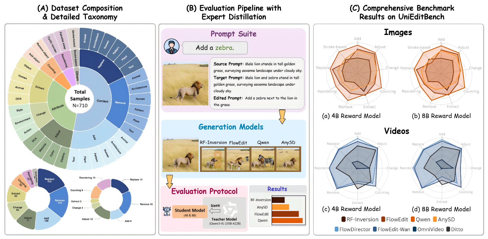
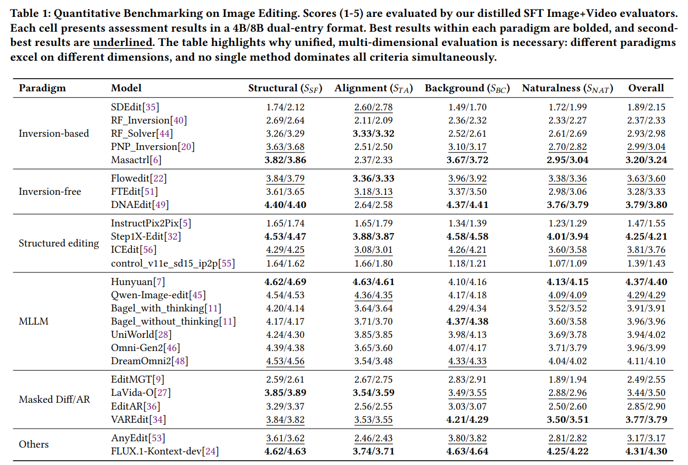
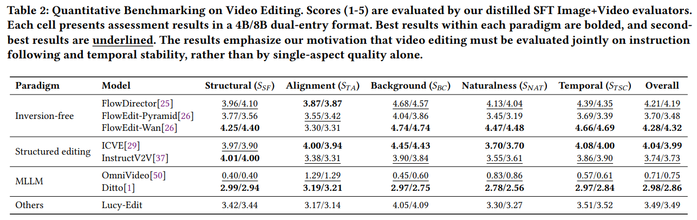

<h1 align="center">UniEditBench: A Unified and Cost-Effective Benchmark for Image and Video Editing via Distilled MLLMs</h1>

<p align="center">
  <a href="https://arxiv.org/abs/2604.15871"></a>
  <a href="https://huggingface.co/datasets/wesar1/UniEditBench">
  
</a>
  <a href="https://huggingface.co/wesar1/UniEditBench_models"></a>

<div align="center">
  <strong>Lifan Jiang</strong> &nbsp;
  <strong>Tianrun Wu</strong> &nbsp;
  <strong>Yuhang Pei</strong> &nbsp;
  <br>
  <strong>Chenyang Wang</strong> &nbsp;
  <strong>Boxi Wu</strong> &nbsp;
  <strong>Deng Cai</strong>
</div>

<div align="center">
  State Key Lab of CAD&CG, Zhejiang University
</div>
  
## 🌐 Overview

UniEditBench is a unified benchmark for image and video editing, comprising **633 images** and **77 videos**, for a total of **710 aligned samples**. The data are collected from existing benchmarks and high-quality internet sources, and the editing prompts are standardized into a triplet format of (source prompt / target prompt / editing instruction) to enable fair comparison across different editing paradigms. 

In terms of task coverage, the image benchmark includes **9 editing operations**: Add, Remove, Replace, Change, Stroke-based, Extract, Adjust, Count, and Reorder; the video benchmark covers **8 operations** (excluding Stroke-based). The dataset further spans diverse visual styles, including realistic photography, 2D anime, 3D rendering, and oil painting, as well as a wide range of semantic domains such as portraits, animals, landscapes, and urban scenes. 

We have evaluated **25** open-source image editing models and **8** open-source video editing models, covering inversion-based, inversion-free, structured editing, MLLM-based, masked diffusion, and autoregressive approaches. For evaluation, we employs 4B/8B reward models distilled from Qwen3-VL-235B-A22B, providing unified scoring across dimensions including **structural fidelity, text alignment, background consistency, naturalness**, and **temporal-spatial consistency** of videos.



## ⚙️ Setup
- Python 3.10

Setup the environment by running:

```bash
pip install -r requirements.txt
```
## 🚀 Usage
### 1. Get your edit results
First, download the benchmark [UniEditBench](https://huggingface.co/datasets/wesar1/UniEditBench) , load the dataset and use your model to get edit results:

```python
from datasets import load_dataset

dataset = load_dataset("/path/to/UniEditBench")

for image_item in dataset["images"]:
    edit_image(image_item)

for video_item in dataset["videos"]:
    edit_video(video_item)
```

Then, build a metadata file like `assets/metadata_example.json`:

```json
[
    {
        "id": "0000",
        "path": "./UniEditBench/images/add/animal/001.png",
        "width": 1920,
        "height": 1280,
        "source_prompt": "Male lion stands in tall golden grass, surveying savanna landscape under cloudy sky.",
        "target_prompt": "Male lion and zebra stand in tall golden grass, surveying savanna landscape under cloudy sky.",
        "edited_prompt": "add a zebra next to the lion in the grass",
        "edit_type": "add",
        "edit_model": "edit_model",
        "edit_path": "edit_image_path"
    },
    {
        "id": "0001",
        "path": "./UniEditBench/images/add/animal/002.png",
        "width": 1920,
        "height": 1280,
        "source_prompt": "Elephant walks through golden grass field with distant hills under soft sunlight.",
        "target_prompt": "Elephant and zebra walk through golden grass field with distant hills under soft sunlight.",
        "edited_prompt": "add a zebra next to the elephant in the grass field",
        "edit_type": "add",
        "edit_model": "edit_model",
        "edit_path": "edit_image_path"
    }
]
```

### 2. Evaluation

#### Deploy

Download weights of [Qwen3-VL-4B-Instruct](https://huggingface.co/Qwen/Qwen3-VL-4B-Instruct) and [Qwen3-VL-8B-Instruct](https://huggingface.co/Qwen/Qwen3-VL-8B-Instruct) .

Download lora weights [UniEditBench_models](https://huggingface.co/wesar1/UniEditBench_models) and deploy our reward model:

```bash
CUDA_VISIBLE_DEVICES=0 swift deploy \
    --model /path/to/Qwen3-VL-4B-Instruct \
    --adapters /path/to/sft_image_lora_4b \
    --device_map balanced \
    --vllm_tensor_parallel_size 1 \
    --attn_impl eager \
    --infer_backend vllm \
    --port 8003 \
    --vllm_max_lora_rank 32 \
    --max_new_tokens 2048 \
    --served_model_name Qwen3-VL-4B-SFT-Image
```

More scrips are available in `scripts/deploy_qwen3vl.sh` .

#### Inference

Get the model response using:

```bash
python inference.py \
    --metadata_path path_tor_your_metadata.json \
    --save_path ./results/image_eval.json \
    --media_type image \
    --port 8003 \
    --max_workers 10
```

More scrips are available in `scripts/infer.sh` .

#### Extract Score

Extract the score from response using:

```bash
python extract_score.py --input path_to_your_image_results.json --media_type image
```

More scrips are available in `scripts/extract.sh` .

The output will include scores for different models across various dimensions.

## 📊 Results

Table 1 and Table 2 present the evaluation results for image editing models and video editing models, respectively.





## 📝 Citation

If you find UniEditBench helpful, please cite:

```bibtex
@misc{jiang2026unieditbenchunifiedcosteffectivebenchmark,
      title={UniEditBench: A Unified and Cost-Effective Benchmark for Image and Video Editing via Distilled MLLMs}, 
      author={Lifan Jiang and Tianrun Wu and Yuhang Pei and Chenyang Wang and Boxi Wu and Deng Cai},
      year={2026},
      eprint={2604.15871},
      archivePrefix={arXiv},
      primaryClass={cs.CV},
      url={https://arxiv.org/abs/2604.15871}, 
}
```
